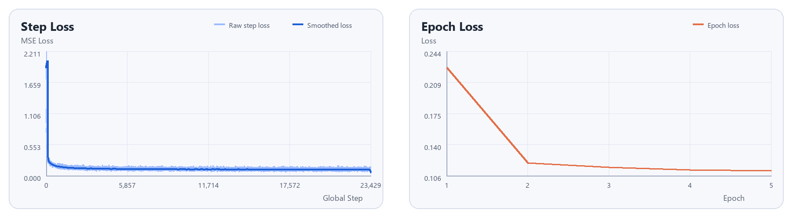
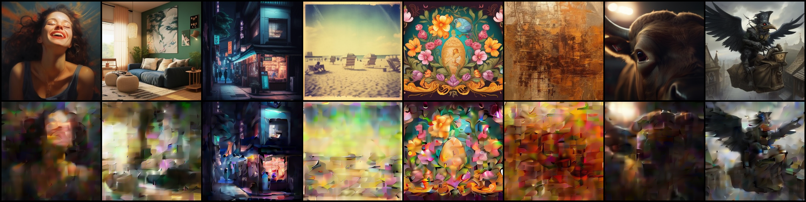
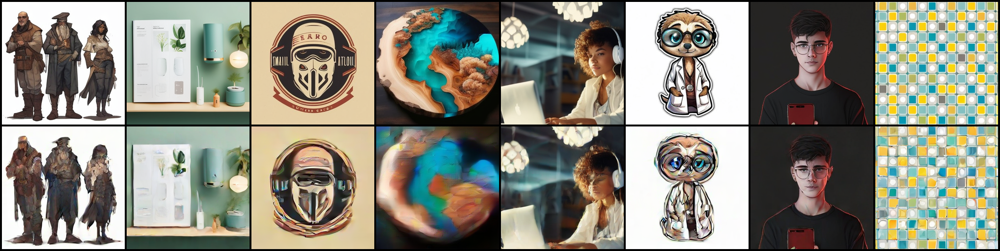
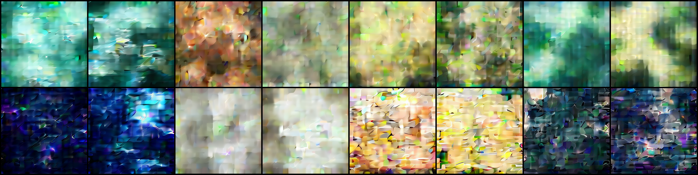
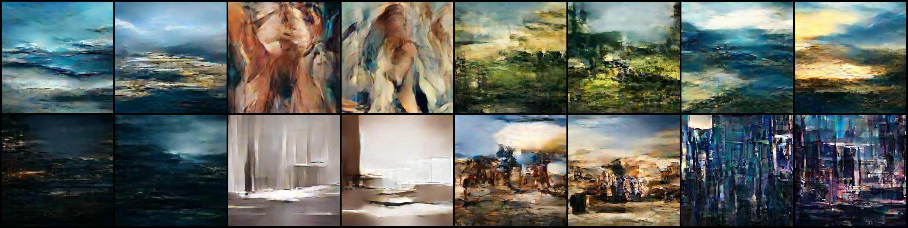
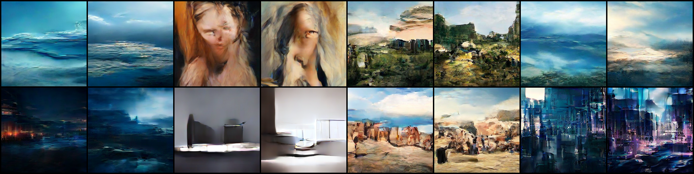
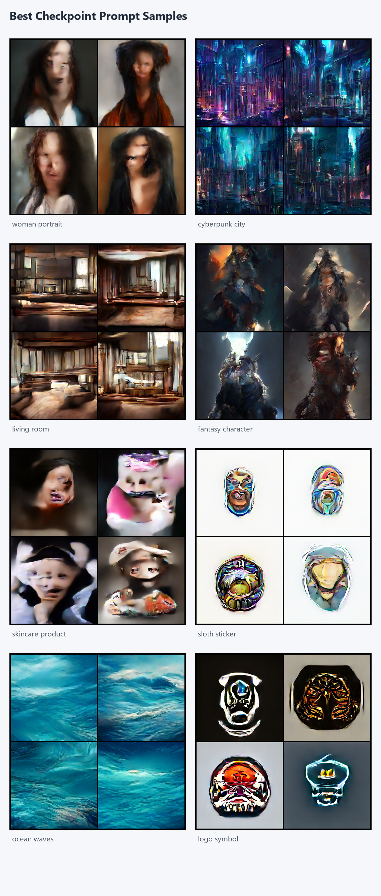

# 9.2.4 实验结果、演化过程与采样分析

真正能说明这个 Demo 是否学到东西的，并不是最后那批样图本身，而是训练过程中是否出现了清楚的演化轨迹：loss 是否稳定下降，重构图是否越来越能保留主体结构，采样图是否从接近噪声逐步转向更明确的场景和类别形态，以及训练完成后模型在一组小规模提示词上到底表现出哪些能力、又暴露出哪些限制。

## 1. 本次实验的观察范围

这一轮运行采用的是一个适合单卡观察的正式 Demo 配置。它的目的不是追求完全收敛，而是在可控训练时间内，把模型从早期到后期的关键变化尽量完整地保留下来。实际运行的核心设置如下：

表9.2.1 本次实验的训练配置与观察点

| 项目 | 设置 |
| --- | --- |
| 预处理特征 | `small_ldt` 的 `mj` 半量子子集 |
| 训练样本规模 | 约 `299,898` 条 |
| 模型宽度与深度 | `embed_dim = 768`，`n_layers = 12` |
| 潜空间 patch 设置 | `patch_size = 2`，`image_size = 32` |
| 训练批大小 | `batch_size = 64` |
| 训练轮数 | `5` 个 epoch |
| 重构图保存频率 | 每 `1000 step` 保存一次 |
| 采样图保存频率 | 每 `3000 step` 保存一次 |
| 早停策略 | 不启用 |

这组设置的意义并不是证明模型已经达到某个正式质量门槛，而是确保训练过程中能够留下足够密的观察点。更合适的理解方式，是把它当作一条训练演化曲线，而不是面向真实使用的最终结论。

## 2. 损失下降与训练稳定性

从训练摘要看，本次运行一共记录了 `23430` 个 step 和 `5` 个 epoch。关键数值如下：

表9.2.2 训练摘要中的关键指标

| 指标 | 数值 |
| --- | --- |
| 总 step 数 | `23430` |
| 总 epoch 数 | `5` |
| `first_step_loss` | `3.1687` |
| `last_step_loss` | `0.0938` |
| `first_epoch_mean_loss` | `0.2258` |
| `last_epoch_mean_loss` | `0.1116` |
| `best_epoch` | `5` |
| `best_epoch_mean_loss` | `0.1116` |

这些数值说明训练过程至少在两个层面上是成立的。

第一，模型在训练初期很快脱离了“完全不会预测”的状态。无论看 step loss 还是 epoch mean loss，前期都存在明显下降，说明去噪器已经开始学习潜变量分布以及文本条件与图像内容之间的对应关系。

第二，损失并不是在第一个 epoch 后立刻停滞，而是在后续 epoch 中继续缓慢下降。对于这种 Demo 规模训练，这一点非常重要，因为它说明模型虽然还远未达到高质量生成状态，但训练并没有明显发散，也没有陷入无意义的随机波动。

因此，单看 loss 就可以先得出一个谨慎判断：这条训练主链是有效的，且模型已经进入了“能够逐步积累视觉结构知识”的阶段。真正需要继续判断的是，这种下降是否对应了图像质量的改善。

图9.2.1 训练过程中的 loss 曲线

图9.2.1 左侧给出了逐 step 的原始损失与平滑损失，右侧给出了逐 epoch 的平均损失。可以看到，step loss 在训练初期快速下行，随后进入较平稳的缓慢收敛区间；epoch loss 则从第 `1` 个 epoch 之后继续下降，并在第 `5` 个 epoch 达到当前最好水平。这与表9.2.2 中的数值是一致的，也为后面的图像质量讨论提供了定量背景。

## 3. 重构图如何随着迭代逐步改善

在这一类文本生成图像项目里，重构图通常是判断模型是否学到潜空间结构的第一类直观证据。与最终自由采样不同，重构更接近“给定目标 latent，模型能否把它恢复到接近原图的方向”。如果这一步长期做不好，那么后续自由采样通常也很难稳定。

从本次运行保存的重构图看，训练早期和后期之间存在明显差异。

在 `step 1000` 附近，模型虽然已经能够保留部分主色调和大致亮暗关系，但大多数样本仍停留在“模糊块面 + 破碎局部纹理”的水平。人物轮廓、室内结构、图案边界和物体主体都还不稳定，很多图像只能大致看出颜色和构图方向，尚不足以形成清楚语义。

图9.2.2 训练早期的重构结果（上排为目标图像，下排为模型重构）

随着训练继续推进，到中后期时，重构开始表现出更明确的主体对应关系。到了 `step 23000` 附近，下排预测图已经能够较明显地对应上排原图的语义类型：人物类样本能够保留大致的人脸和发型区域，室内与产品类样本能够保留主要构图，图案和标志类样本能够保留核心色彩布局和主体边界。虽然这些重构仍然存在平滑、模糊和局部形变，但它们已经不再是随机猜测，而是在相当稳定地恢复目标图像的结构方向。

图9.2.3 训练后期的重构结果（上排为目标图像，下排为模型重构）

这个变化说明了两点。

1. 模型首先学到的不是高频细节，而是主体布局、色块关系和语义大类。
2. 对当前 Demo 而言，重构能力的改善早于高质量自由采样能力的形成。

也就是说，随着训练迭代增加，模型先在“看懂潜空间中什么结构是合理的”这一步站稳，然后才逐步把这种结构知识迁移到自由采样过程中。

## 4. 采样图如何从接近噪声走向较清晰结构

如果说重构图回答的是“模型是否开始理解训练分布”，那么训练中的阶段性采样图回答的就是“模型是否已经能够在无配对目标图的情况下生成较稳定结果”。这一点正是扩散模型训练过程中最值得观察的现象。

从本次运行保留的 `sample_step_003000`、`sample_step_012000` 和 `sample_step_021000` 三个阶段来看，图像质量的变化可以概括为三个层次。

第一阶段是训练较早期。在 `step 3000` 时，图像整体仍以模糊色块、局部纹理和不稳定轮廓为主。此时模型已经不再输出纯随机噪声，但大多数结果仍然更像是“带有某种颜色偏好的抽象块面”，很难稳定形成可辨认对象或场景。

图9.2.4 `step 3000` 的阶段性采样结果

第二阶段是训练中期。到了 `step 12000` 附近，图像开始出现较清楚的海面、城市、房间和人物轮廓等高层结构。虽然边缘仍然模糊、局部仍然扭曲，但已经可以明显看出模型不再只是控制颜色，而是在尝试组织空间布局和对象关系。换言之，采样结果从“只有纹理和配色”推进到了“开始有场景和类别感”。

图9.2.5 `step 12000` 的阶段性采样结果

第三阶段是训练后期。到了 `step 21000` 附近，若干图像已经能够稳定表现出海面、城市街景、室内空间等较大场景结构；同时，某些人物和复杂对象虽然仍然存在融化感和局部错位，但已经能看出明确的目标方向。这表明模型在当前训练轮数下，已经越过了“近似噪声”的阶段，进入了“能够形成稳定场景骨架，但高精度细节仍不充分”的阶段。

图9.2.6 `step 21000` 的阶段性采样结果

从这条演化曲线中，可以提炼出一个非常适合写进图书的观察结论：扩散模型的训练效果并不是一步到位跃迁出来的，而是随着迭代增加，先形成颜色和布局，再形成场景和类别，最后才逐步逼近更高质量的结构与细节。对于 Demo 级案例，这种从模糊到较清晰的连续变化，本身就是最有解释力的结果。

## 5. 训练完成后的推理采样

训练结束后，又使用最佳权重对一组简洁提示词进行了独立采样。这里使用的小规模 prompt 集并不打算覆盖广泛真实需求，它的作用只是让读者直观看到：在训练完成后，模型对不同类型文本条件的响应已经走到了什么程度。

这一轮采样使用了 `8` 个提示词，每个提示词生成 `4` 张图像，提示词包括：

- `woman portrait`
- `cyberpunk city`
- `living room`
- `fantasy character`
- `skincare product`
- `sloth sticker`
- `ocean waves`
- `logo symbol`

图9.2.7 最佳权重上的 prompt 采样画廊

从最终结果看，几类提示词的表现差异比较明显。

1、场景类提示词最稳定  
`cyberpunk city`、`living room` 和 `ocean waves` 这类场景或环境型提示词，生成结果整体更稳定。它们往往能够较早形成空间布局、光照方向和整体氛围，即使局部细节不够精确，读者也能较明确地识别出目标类别。

2、风格与类别感已经形成，但仍然不均衡  
`fantasy character`、`sloth sticker` 和 `logo symbol` 已经表现出较明确的类别聚合趋势。尤其是标志、贴纸和某些风格化对象，模型能够生成“像这个类别”的图像，而不只是随机纹理。这说明文本条件已经开始真正参与视觉分布的选择。

3、人物和产品类仍然偏弱  
`woman portrait` 和 `skincare product` 的结果仍然暴露出最明显的问题。人物脸部结构容易扭曲，产品图的几何边界和局部材质也不够稳定。这说明在当前训练规模与训练轮数下，模型已经能形成语义方向，但还不足以稳定控制细粒度结构。

这一结果与训练阶段观察到的现象是一致的：模型先学会的是场景、风格和大类语义，再逐步逼近更精细的人物、产品和几何结构。对于一本实践型图书来说，这种“不同类别的形成速度不同”的观察，比单纯给出一张代表性样图更有信息量。

## 6. 如何理解这一组结果

把 loss、重构图、阶段性采样图和训练后 prompt 采样放在一起看，可以得到一个相对完整的判断。

第一，这个 Demo 已经清楚展示了文本生成图像系统的基本学习过程。随着训练步数增加，模型确实经历了从接近噪声到出现轮廓，再到形成较稳定场景结构的演化。

第二，当前结果能够说明模型已经学到了文本条件和图像分布之间的基础对应关系，但还不足以说明它具备广泛、稳定、可直接使用的生成能力。特别是在人物、产品和高精度结构控制方面，现有样本仍然明显偏弱。

第三，这组结果非常适合作为“原理展示型案例”，而不适合作为“质量证明型案例”。它的价值在于让读者看见扩散模型如何学习、如何改善、如何暴露边界，而不是把有限规模训练包装成成熟系统。

## 7. 小结

综合本次实验结果，可以把这一节的核心结论概括为以下几点。

- 训练过程在当前配置下是稳定的，loss 呈现持续下降趋势。
- 重构图随着训练迭代增加，逐步从模糊块面过渡到能够保留主体结构和语义类型。
- 采样图随着训练推进，经历了从接近噪声到形成场景轮廓、再到具备较明确类别感的变化。
- 训练完成后的推理采样表明，场景类提示词更容易获得稳定结果，人物和产品类提示词仍然存在明显结构缺陷。
- 因而，最重要的意义不是“生成效果已经足够真实使用”，而是清楚展示了一个 Demo 级 Latent Diffusion 系统如何随着训练逐步学会生成。
